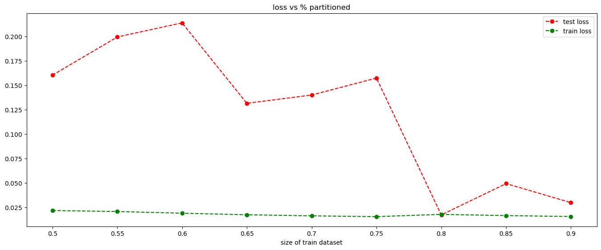

# Gohil Megh Hiteshkumar

## Week 1 - Task 1
In this task, I implemented xgboost classification algorithm.
1. Read the csv file and created X(feature), y(target) dataset for the machine learning.
2. Created a np array of arithmatic progession staring from 0.05 to 0.95 with difference of 0.05. These are the training sizes.
3. For each size, the model was trained and train and test loss was calculated. The loss function used here is mlogloss.
4. Then the graph was plotted and it was seen that train : test ratio of 0.8 : 0.2 is the optimal one.

## Week 1 - Task 2
In this task, I implemented KNN, Naive-Bayes, Decision tree classification algorithm.
1. Read the csv file and created X(feature), y(target) dataset for the machine learning.
2. Converted all non integer values to integer values and all NaN values to mean of the column in which it is located.
3. 0.8 : 0.2 was chosen as the train : test ratio. For each algorithm the data was scaled and then trained.
4. After the data was trained, the model was used to predict values and given output was tested against actual output, then the accuracy for each algorithm was calculated. The result is displayed below

Classifier used | Accuracy(in percentage) 
--- | ---
KNN | 85
--- | ---
Naive-Bayes | 83
--- | ---
Decision tree | 81

